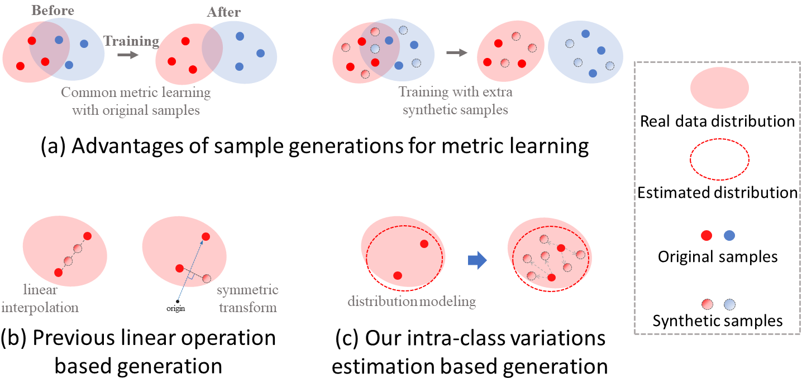
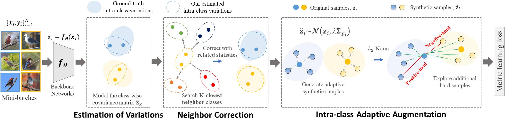

# IAA: Intra-class Adaptive Augmentation with Neighbor Correctionfor Deep Metric Learning

The PyTorch codes for our paper "[Intra-class Adaptive Augmentation with Neighbor Correctionfor Deep Metric Learning](https://github.com/darkpromise98/IAA/blob/main/pdf/Intra-class%20Adaptive%20Augmentation%20with%20Neighbor%20Correction%20for%20Deep%20Metric%20Learning.pdf)", which is accepted by the IEEE Transactions on Multimedia, 2022.
It is built on top of the [MDR](https://github.com/kakaoenterprise/AAAI2021_MDR).

## Introduction

Deep metric learning aims to learn an embedding space, where semantically similar samples are close together and dissimilar ones are repelled against. 
To explore more hard and informative training signals for augmentation and generalization, recent methods focus on generating synthetic samples to boost metric learning losses. However, these methods just use the deterministic and class-independent generations (e.g., simple linear interpolation), which only can cover the limited part of distribution spaces around original samples. They have overlooked the wide characteristic changes of different classes and can not model abundant intra-class variations for generations. Therefore, generated samples not only lack rich semantics within the certain class, but also might be noisy signals to disturb training. In this paper, we propose a novel intra-class adaptive augmentation (IAA) framework for deep metric learning. We reasonably estimate intra-class variations for every class and generate adaptive synthetic samples to support hard samples mining and boost metric learning losses. Further, for most datasets that have a few samples within the class, we propose the neighbor correction to revise the inaccurate estimations, according to our correlation discovery where similar classes generally have similar variation distributions. Extensive experiments on five benchmarks show our method significantly improves and outperforms the state-of-the-art methods on retrieval performances by 3\%-6\%.

### Motivation of IAA




### Framework of IAA




## Requirements

We recommended the following dependencies.

- Python 3.8
- [torch](http://pytorch.org/) 1.7.0
- [torchvision](https://github.com/pytorch/vision) 0.8.0
- [numpy](http://www.numpy.org/)
- tqdm
- scipy
- Pillow
- matplotlib


## Preparing Datasets

1. Download these datasets.
   - [CUB-200-2011](http://www.vision.caltech.edu/visipedia-data/CUB-200-2011/CUB_200_2011.tgz)
   - Cars-196 ([Img](http://imagenet.stanford.edu/internal/car196/car_ims.tgz), [Annotation](http://imagenet.stanford.edu/internal/car196/cars_annos.mat))
   - [Stanford Online Products](https://cvgl.stanford.edu/projects/lifted_struct/)
   - [In-Shop Clothes Retrieval](https://drive.google.com/open?id=0B7EVK8r0v71pQ2FuZ0k0QnhBQnc)

2. Extract the compressed file (tgz or zip) into `MyDataset/`, e.g., for Cars-196, put the files in the `MyDataset/Cars196`. Other naming ways can see the python files of realted datatsets in  `utils/dataset`, or modify these names in your way.


## Training

1. Set up the related **arguments**.
   - The folder `MyDataset` is the root path of datasets using in this paper (including CUB, CARS, SOP), which can be customized by the argparse parameter `--data`. 

   - The folder `results` is the log path to record corresponding models and results of training, which can be customized by the argparse parameter `--save-dir`. 

   - The folder `weights_models` is the path to put the weighting parameters of pretrained backbone networks, which can be customized by the argparse parameter `--weight_path`. 

2. Run `train.py` for different metric learning **losses** and **datasets**.

#### CUB-200-2011
```bash
# googlenet
python run.py --dataset cub200 --backbone googlenet --loss MS --intra_lamda 0.8 --aug_num 3
python run.py --dataset cub200 --backbone googlenet --loss Contrastive  --lr 3e-5  --intra_lamda 0.8 --aug_num 3
```

#### Cars-196
```bash
# googlenet
python run.py --dataset cars196 --backbone googlenet --loss MS --intra_lamda 0.8 --aug_num 3
python run.py --dataset cars196 --backbone googlenet --loss Contrastive --intra_lamda 0.8 --aug_num 3
```

#### Stanford Online Products
```bash
# googlenet
python run.py --dataset stanford --backbone googlenet --batch 180 --lr 1e-4 --loss MS --intra_lamda 0.6 --aug_num 3
python run.py --dataset stanford --backbone googlenet --batch 180 --lr 1e-4 --loss Contrastive --intra_lamda 0.6 --aug_num 2
```
```bash
# bninception
python run.py --dataset stanford --backbone bninception --batch 256 --lr 1e-4 --loss MS -intra_lamda 0.5 --aug_num 3

# resnet50
python run.py --dataset stanford --backbone resnet50 --batch 256 --lr 1e-4 --loss MS -intra_lamda 0.5 --aug_num 3
```

#### In-Shop Clothes Retrieval
```bash
# googlenet
python run.py --dataset inshop --backbone googlenet --batch 180 --lr 1e-4 --loss MS --intra_lamda 0.6 --aug_num 3
python run.py --dataset inshop --backbone googlenet --batch 180 --lr 1e-4 --loss Contrastive --intra_lamda 0.6 --aug_num 2
```

```bash
# bninception
python run.py --dataset inshop --backbone bninception --batch 256 --lr 1e-4 --loss MS --intra_lamda 0.5 --aug_num 3

# resnet50
python run.py --dataset inshop --backbone resnet50 --batch 256 --lr 1e-4 --loss MS --intra_lamda 0.5 --aug_num 3
```


## Reference

If you found this code useful, please cite the following paper:

```
@article{Fu2022IAA,
author = {Zheren Fu and Zhendong Mao and Bo Hu and An-an Liu and Yongdong Zhang},
title = {Intra-class Adaptive Augmentation with Neighbor Correctionfor Deep Metric Learning},
year = {2022},
journal = {IEEE Transactions on Multimedia},
}
```

## Contact
If you have any quetions, please directly open a new issue or contact fzr@mail.ustc.edu.cn. Thanks!

## License

[Apache License 2.0](http://www.apache.org/licenses/LICENSE-2.0)

